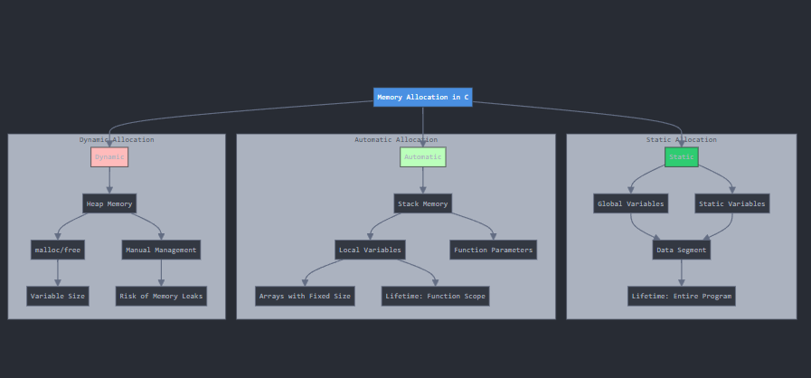

## 🔍 **Introduzione all'Allocazione della Memoria**

In C, l'allocazione della memoria si divide in tre categorie principali:

1. **Allocazione Statica:** Avviene a tempo di compilazione.  
2. **Allocazione Automatica:** Avviene nello stack di una funzione.  
3. **Allocazione Dinamica:** Avviene a runtime nell'heap, richiede gestione manuale.

---

## 🗂️ **Argomenti Trattati**

| **#** | **Argomento**                            |
|-------|------------------------------------------|
| 1     | Allocazione Statica                      |
| 2     | Allocazione Automatica                   |
| 3     | Allocazione Dinamica                     |
| 4     | Esempio di Funzione con Allocazione Heap |

---

## 💻 **Codice Esempio**
```c
#include <stdio.h>
#include <stdlib.h>

#define SIZE 100
static int array_statico[SIZE];  // Allocazione statica
static int contatore = 0;        // Esempio di variabile statica

int somma(int x, int y) {
    int risultato = x + y;  // Allocazione automatica
    return risultato;
}

int* crea_array(int k) {
    int* arr = malloc(sizeof(int) * k);
    if (arr == NULL) {
        return NULL;  // Gestione errore malloc
    }
    for (int i = 0; i < k; i++) {
        arr[i] = 2 * i;
    }
    return arr;
}

int main() {
    int x;  // Allocazione automatica
    int y = 3;

    int* array_dinamico = (int*)malloc(5 * sizeof(int));
    if (array_dinamico == NULL) {
        printf("Errore allocazione memoria\n");
        return 1;
    }

    free(array_dinamico);  // Deallocazione memoria dinamica

    return 0;
}
```

---

## 📚 **Spiegazione Approfondita**

### **1) Allocazione Statica**
L'allocazione statica avviene a **tempo di compilazione**. Le variabili allocate staticamente:

- Rimangono in memoria per tutta la durata del programma.
- Vengono memorizzate nel segmento **data** o **bss** del programma.

**Esempio:**
```c
#define SIZE 100
static int array_statico[SIZE];
static int contatore = 0;
```

| Variabile       | Contenuto | Durata della Memoria |
|-----------------|-----------|----------------------|
| `array_statico` | -         | Fino al termine     |
| `contatore`     | 0         | Fino al termine     |

---

### **2) Allocazione Automatica**
L'allocazione automatica avviene nello **stack**. Queste variabili:

- Vengono allocate all'ingresso della funzione e deallocate automaticamente all'uscita.
- Sono più veloci rispetto all'allocazione dinamica.

**Esempio:**
```c
int somma(int x, int y) {
    int risultato = x + y;  // Variabile automatica
    return risultato;
}
```

| Variabile  | Contenuto   | Durata della Memoria |
|------------|-------------|----------------------|
| `risultato`| `x + y`     | Fino all'uscita      |

---

### **3) Allocazione Dinamica**
L'allocazione dinamica avviene nell'**heap**, richiedendo gestione manuale con le funzioni:

- `malloc(size_t size)` per allocare.
- `free(void* ptr)` per deallocare.

**Vantaggi:**
- Flessibilità per strutture dati di dimensione variabile.

**Svantaggi:**
- Richiede gestione manuale per evitare perdite di memoria.

**Esempio:**
```c
int* array_dinamico = (int*)malloc(5 * sizeof(int));
if (array_dinamico == NULL) {
    printf("Errore allocazione memoria\n");
    return 1;
}
free(array_dinamico);  // Deallocazione memoria
```

---

### **4) Funzione con Allocazione Heap**

Le funzioni possono restituire puntatori a memoria allocata dinamicamente. È importante ricordarsi di **liberare la memoria**.

**Esempio:**
```c
int* crea_array(int k) {
    int* arr = malloc(sizeof(int) * k);
    if (arr == NULL) {
        return NULL;
    }
    for (int i = 0; i < k; i++) {
        arr[i] = 2 * i;
    }
    return arr;
}
```

---

## 📝 **Nota Importante**
- Usare `malloc` con attenzione: ogni chiamata deve avere un corrispondente `free`.
- Le variabili allocate staticamente occupano memoria per tutta la durata del programma.
- L'allocazione automatica è preferibile per variabili temporanee all'interno di funzioni.

---

## 🚀 **Buono Studio e Buona Programmazione!**
