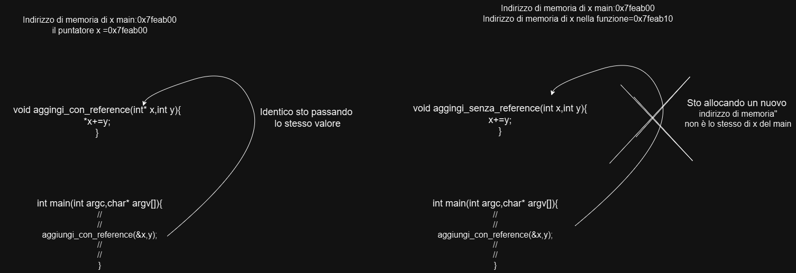

# 📘 Guida alle Funzioni in C - Programmazione 1

Questa repository è pensata per aiutare gli studenti di **Programmazione 1** a comprendere le funzioni in C in modo chiaro ed efficace.  
Ogni sezione è accompagnata da esempi pratici e immagini che spiegano concetti complessi in maniera visiva.

---

## 🚀 **Aggiornamenti e Refactoring**
Il codice è stato riorganizzato per seguire le **best practices** di programmazione:
- **[prototipi.h](prototipi.h)**: Contiene tutte le dichiarazioni delle funzioni e le costanti (`RIGHE`, `COLONNE`).
- **[definizioni.c](definizioni.c)**: Contiene l'implementazione di tutte le funzioni.
- **[funzioni.c](funzioni.c)**: Contiene il `main` e le chiamate di test.

---

## 🔍 **Introduzione alle Funzioni**

Una **funzione** è un blocco di codice che esegue un'operazione specifica e che può essere riutilizzato in diverse parti di un programma.  
Le funzioni permettono di strutturare il codice in modo modulare, facilitandone la comprensione, manutenzione e riutilizzo.

---

## 🗂️ **Argomenti Trattati**

Ecco un elenco degli argomenti con i riferimenti ai file dove trovarne l'implementazione:

| **#** | **Argomento** | **File di Riferimento** |
|-------|--------------|-------------------------|
| 1 | Che cos'è una funzione | [definizioni.c](definizioni.c) |
| 2 | Definizione e struttura di una funzione | [definizioni.c](definizioni.c) |
| 3 | Invocazione di una funzione | [funzioni.c](funzioni.c) |
| 4 | Definizione vs Prototipo | [prototipi.h](prototipi.h) vs [definizioni.c](definizioni.c) |
| 5 | Parametri attuali vs Parametri formali | [funzioni.c](funzioni.c) (attuali) vs [definizioni.c](definizioni.c) (formali) |
| 6 | Passaggio mediante indirizzo e per valore | [definizioni.c](definizioni.c) (`somma_numerica`, `somma_numerica_reference`) |
| 7 | Allocazione automatica, dinamica, statica | [definizioni.c](definizioni.c) |
| 8 | Passaggio di array a funzioni | [definizioni.c](definizioni.c) (`stampa_array`) |
| 9 | Passaggio di array multidimensionali | [definizioni.c](definizioni.c) (`costruisci_matrice`) |
| 10 | Accesso ad indirizzi e valori | [definizioni.c](definizioni.c) |

---

## 📚 **Spiegazione Approfondita**

### **1) Che cos'è una Funzione**
Una funzione è un blocco di codice riutilizzabile, progettato per eseguire un'operazione specifica. Le funzioni possono:
- Ricevere dati in ingresso (parametri).
- Restituire un valore (opzionale).

### **2) Definizione e Struttura di una Funzione**
La struttura di una funzione include:
- **Tipo di ritorno**: indica il tipo di valore restituito dalla funzione.
- **Nome della funzione**: rappresenta il suo identificativo.
- **Parametri**: specificano i dati in ingresso.
- **Corpo della funzione**: contiene le istruzioni eseguite.

Esempio:
```c
int somma(int a, int b) {
    return a + b;
}
```

### **3) Invocazione di una Funzione**
Per utilizzare una funzione, è necessario invocarla specificandone il nome e i parametri richiesti.

Esempio:
```c
int risultato = somma(3, 5);
```

### **4) Definizione vs Prototipo**
- **Prototipo** ([prototipi.h](prototipi.h)): è una dichiarazione della funzione senza il corpo. Serve per indicare al compilatore la sua esistenza.
  ```c
  int somma(int a, int b); // Prototipo
  ```
- **Definizione** ([definizioni.c](definizioni.c)): include il corpo della funzione con le istruzioni da eseguire.
  ```c
  int somma(int a, int b) {
      return a + b;
  }
  ```

### **5) Parametri Attuali vs Parametri Formali**
- **Parametri Formali**: definiti nella dichiarazione della funzione e agiscono come variabili locali.
- **Parametri Attuali**: valori effettivi passati alla funzione al momento dell'invocazione.

### **6) Passaggio Mediante Indirizzo e per Valore**
- **Per Valore**: viene passato alla funzione una copia del valore originale.
- **Per Indirizzo**: viene passato l'indirizzo della variabile, permettendo di modificarene il valore originale.
    ```c
    void incrementa(int* x) { *x = *x + 1; }
    ```
    
    

> 💡 **Consiglio:** Per capire meglio come funzionano gli indirizzi di memoria, consulta la cartella **[puntatori](../puntatori)** di questa repository.

### **7) Allocazione Automatica, Dinamica, Statica**
- **Automatica**: variabili create automaticamente all'interno di una funzione.
- **Dinamica**: memoria allocata esplicitamente durante l'esecuzione del programma.
- **Statica**: memoria riservata per tutta la durata del programma.

### **8) Passaggio di Array a Funzioni**
Gli array vengono passati tramite indirizzo (puntatore al primo elemento).

### **9) Passaggio di Array Multidimensionali**
Anche gli array multidimensionali possono essere passati a funzioni, specificando le loro dimensioni.

### **10) Accesso ad Indirizzi e Valori con Array Multidimensionali**
Con array multidimensionali, possiamo accedere direttamente agli indirizzi e ai valori:
- **Indirizzi**: `&mat[i][j]`.
- **Valori**: `mat[i][j]`.

> 💡 **Consiglio:** Gli array e le matrici sono strettamente legati ai puntatori. Approfondisci l'argomento nella cartella **[puntatori](../puntatori)**.

---

## 📝 **Nota Importante**
Utilizza immagini e diagrammi per comprendere meglio il flusso dei dati nelle funzioni, soprattutto con parametri e array.

---

## 🚀 **Buono Studio e Buona Programmazione!**
