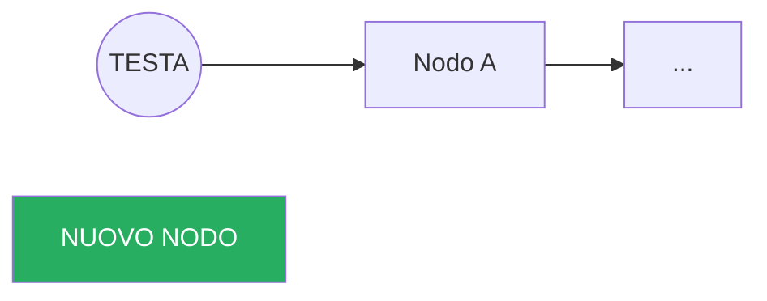
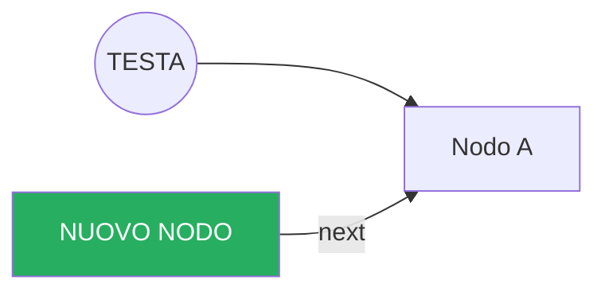

# 🔗 Liste Collegate (Linked Lists) in C

Le liste collegate sono strutture dati dinamiche fondamentali per la gestione flessibile della memoria. A differenza degli array, non richiedono spazio contiguo e possono crescere o ridursi a runtime.

## 📖 Cosa sono le Liste?

Una lista è composta da **nodi**. Ogni nodo contiene dati e un puntatore al prossimo nodo. Il termine della lista è indicato da `NULL`.

---

## 🎨 Logica di Inserimento in Testa (`insert_at_head`)

L'inserimento in testa avviene in tre fasi fondamentali per mantenere integra la catena dei puntatori:

### 1. Stato Iniziale
Abbiamo la lista attuale e un nuovo nodo creato con `malloc`.

### 2. Collegamento (`new_node->next = head`)
Il nuovo nodo punta alla vecchia testa. Ora ci sono due modi per raggiungere il primo elemento.

### 3. Aggiornamento Testa (`head = new_node`)
Spostiamo la testa sul nuovo nodo. L'inserimento è concluso.

---

## 🛠️ Contenuto della cartella

### 1. [linked_list_basics.c](./linked_list_basics.c)
Logica di base: Definizione `struct Node`, `malloc` e inserimento in testa.

### 2. [library_management.c](./library_management.c)
Esempio pratico: Gestione di una biblioteca con inserimento e rimozione per titolo.

### 3. [queue.c](./queue.c)
Implementazione di una **Coda (Queue)** tramite lista collegata (logica FIFO).

---

## 🌐 Altre Risorse
*   [Visualizzazione Liste Collegate (VisuAlgo)](https://visualgo.net/en/list)
*   [Visualizzazione Code (VisuAlgo)](https://visualgo.net/en/list)

> [!IMPORTANT]
> Ricorda sempre di usare la funzione `free()` per ogni nodo creato con `malloc()` quando la lista non serve più.
