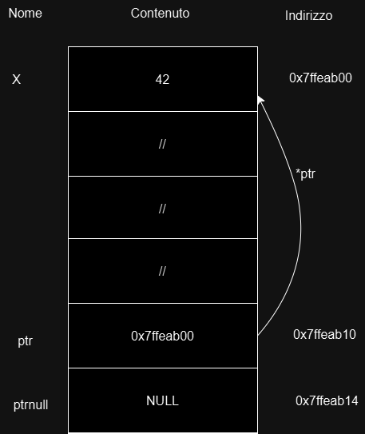

# 📘 Guida ai Puntatori in C - Programmazione 1

Questa repository è pensata per aiutare gli studenti di **Programmazione 1** a comprendere i puntatori in C in modo chiaro ed efficace.  
Ogni sezione è accompagnata da esempi pratici e immagini che spiegano concetti complessi in maniera visiva.

---

## 🔍 **Introduzione ai Puntatori**
Un **puntatore** è una variabile che contiene l'indirizzo di memoria di un'altra variabile.  
Grazie ai puntatori è possibile manipolare direttamente il contenuto delle variabili in memoria.

### **Esempio Visivo**

Nell'immagine seguente puoi vedere come funziona un puntatore con l'aggiunta di un secondo puntatore chiamato `ptrNull`:



- `x` è una variabile con un valore (`42`) e un indirizzo (`0x7ffeab00`).
- `ptr` è il puntatore che **contiene l'indirizzo di `x`** (`0x7ffeab00`).
- Utilizzando `*ptr`, possiamo accedere al valore contenuto in `x`.
- `ptrNull` è un altro puntatore che **contiene un indirizzo di memoria diverso** da quello di `x`. In questo caso, potrebbe essere un indirizzo "null" (ad esempio `NULL` o `0x0`).
  - **Importante:** Un puntatore nullo (come `ptrNull`) non punta a nessun indirizzo valido di memoria, e tentare di dereferenziare un puntatore nullo (`*ptrNull`) provoca un errore di esecuzione (segmentation fault).

### Comportamento di un Puntatore Nullo

- **`ptr`**: punta a un indirizzo valido, che contiene il valore di `x`.
- **`ptrNull`**: è un puntatore nullo, che non punta a nessuna variabile valida in memoria.
  
Se tentiamo di dereferenziare `ptrNull` come nel caso di `*ptrNull`, otterremmo un errore, perché il puntatore non è associato a nessuna variabile valida.

### **Riepilogo**

- **Puntatore valido (`ptr`)**: può essere dereferenziato per ottenere il valore della variabile a cui punta.
- **Puntatore nullo (`ptrNull`)**: non può essere dereferenziato in modo sicuro e genera un errore in fase di esecuzione.


---

## 🗂️ **Argomenti Trattati**
Ecco un elenco delle sezioni presenti nel codice:

| **#** | **Argomento**                                |
|-------|--------------------------------------------|
| 1     | Inizializzazione di un puntatore            |
| 2     | Modifica del valore dell'elemento puntato   |
| 3     | Connessione tra puntatore ed elemento       |
| 4     | Modifica dell'elemento puntato              |
| 5     | Puntatore a costante                        |
| 6     | Puntatore costante a una variabile          |
| 7     | Puntatore costante a una costante           |
| 8     | Passaggio per riferimento a una funzione    |

---

## 💻 **Codice Esempio**
```c
#include <stdio.h>

int main(int argc, char* argv[]) {
    int x = 3;
    int y = 4;

    // 1) Inizializzazione di un puntatore
    // Tipologia dell'elemento che si sta puntando, deferenziatore (*) e nome puntatore = indirizzo di memoria della variabile
    int* ptr = &x; // all'inizio dobbiamo dire che il valore che ptr contiene deve essere l'indirizzo di x successivamente con *ptr andremmo a prendere IL CONTENUTO DI QUEL'INDIRIZZO
    printf("Il valore puntato da ptr è: %d\n", *ptr);

    // 2) Modifica del valore dell'elemento puntato
    *ptr = 5;  // Modifica il valore di x attraverso il puntatore
    printf("Il nuovo valore puntato da ptr è: %d\n", *ptr);

    // 3) Connessione tra puntatore ed elemento puntato
    printf("Il valore di x è: %d\n", x);
    *ptr = 8;
    printf("Dopo modifica tramite ptr, il valore di x è: %d\n", x);
    x = 12;
    printf("Dopo modifica diretta, il valore puntato da ptr è: %d\n", *ptr);

    // 4) Modifica dell'elemento puntato dal puntatore
    ptr = &y;  // Ora ptr punta a y
    printf("Il valore di x è: %d\n", x);
    printf("Il valore di y è: %d\n", y);
    *ptr = 7;  // Modifica il valore di y attraverso ptr
    printf("Dopo modifica tramite ptr, il valore di y è: %d\n", y);

    // 4.1) Puntatore nullo (NULL)
    // Un puntatore nullo è un puntatore che non punta a nessuna locazione di memoria valida.
    // In altre parole, un puntatore nullo è un puntatore che contiene l'indirizzo speciale 'NULL'.Punta a niente che è stato inizializzato.
    // È importante utilizzare i puntatori nulli per evitare errori di memoria e per indicare che un puntatore non è ancora stato inizializzato.

    int* ptrNull = NULL; // Puntatore nullo, non punta a nessuna variabile
    if (ptrNull == NULL) {
        printf("ptrNull è un puntatore nullo.\n");  // Mostra che ptrNull è nullo
    }

    // ATTENZIONE IMPORTANTE:
    //Non tentare mai di dereferenziare un puntatore nullo.
    // Se proviamo a dereferenziare ptrNull, il programma darà un errore (segmentation fault).
    // *ptrNull = 10; // ERRORE: Non è possibile dereferenziare un puntatore nullo! Bisogna prima fallo referenziare a qualcosa.
    // Attenzione quando si ha un puntatore costante ad un NULL (Quindi non possiamo modifica a ciò che il puntatore punta come vedremo in seguito)


    // 5) Puntatore a costante
    // Puntatore a costante: il valore puntato non può essere modificato
    const int* p = &x;
    // *p = 2; // ERRORE: non si può modificare il valore puntato
    p = &y;  // Si può cambiare l'indirizzo di memoria puntato
    printf("Puntatore a costante: il valore puntato è: %d\n", *p);

    // 6) Puntatore costante a una variabile
    // Puntatore costante: il puntatore non può cambiare indirizzo
    int* const prova = &x;
    *prova = 20;  // Modifica il valore di x
    printf("Puntatore costante: il valore di x è: %d\n", *prova);
    // prova = &y; // ERRORE: non si può cambiare l'indirizzo del puntatore

    // 7) Puntatore costante a una costante
    // Puntatore costante a una costante: né il valore puntato né l'indirizzo possono essere modificati
    const int* const finale = &x;
    printf("Puntatore costante a una costante: il valore puntato è: %d\n", *finale);
    // *finale = 30; // ERRORE: non si può modificare il valore puntato
    // finale = &y;  // ERRORE: non si può modificare l'indirizzo del puntatore

    // 8) Cenni sul passaggio per riferimento a una funzione
    // Il passaggio per riferimento permette di modificare i valori delle variabili direttamente all'interno della funzione.
    // Esempio completo nel file funzioni.c

    return 0;
}
```

---

## 📚 **Spiegazione Approfondita**

### **1) Inizializzazione di un Puntatore**
- Un puntatore viene inizializzato con l'indirizzo di una variabile usando l'operatore `&`.

| Variabile | Contenuto | Indirizzo   |
|-----------|-----------|------------|
| `x`       | 42        | 0x7ffeab00 |
| `ptr`     | 0x7ffeab00| 0x7ffeab10 |

---

### **2) Modifica del Valore Puntato**
- Usando `*ptr`, possiamo **modificare il valore** della variabile puntata.

```c
*ptr = 5;  // Cambia il valore di x
```

---

### **3) Connessione tra Puntatore e Variabile**
- Cambiare il valore attraverso il puntatore modifica anche la variabile originale.

---

## 📝 **Nota Importante**
Utilizza l'immagine fornita (`image.png`) insieme al codice per visualizzare la connessione tra variabili e puntatori.

---

## 🚀 **Buono Studio e Buona Programmazione!**

