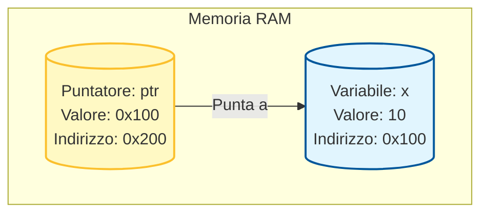
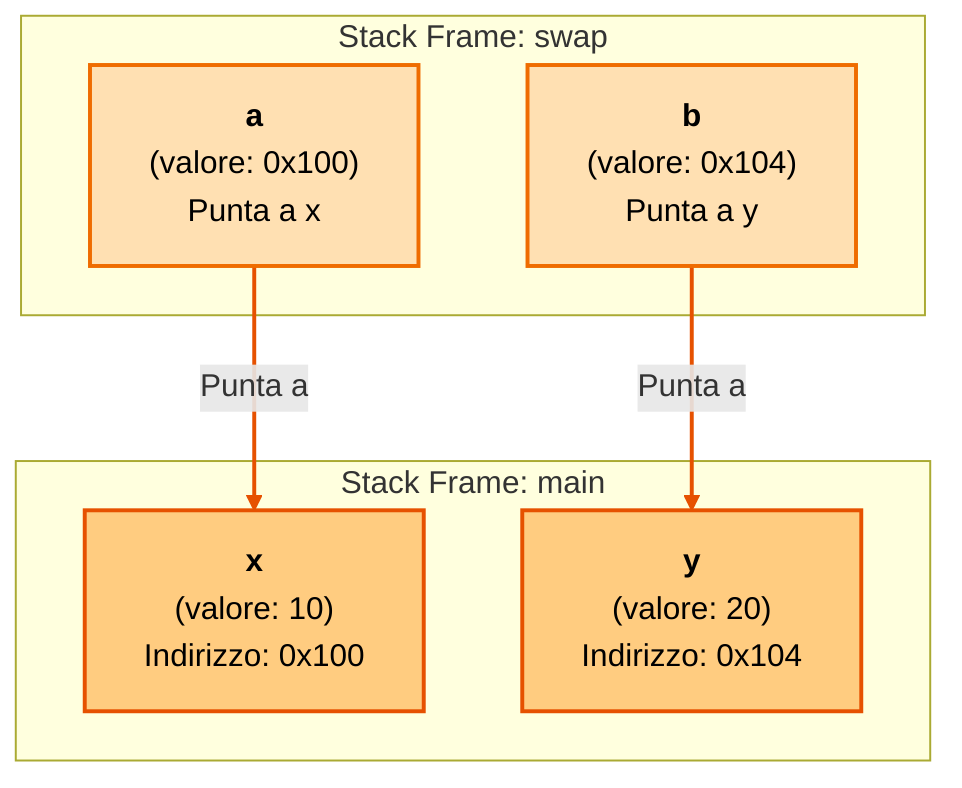

# 📘 Guida ai Puntatori in C - Programmazione 1

Questa repository è pensata per aiutare gli studenti di Programmazione 1 a comprendere i puntatori in C in modo chiaro ed efficace.
Ogni sezione è accompagnata da esempi pratici e immagini che spiegano concetti complessi in maniera visiva.

## 🔍 Introduzione ai Puntatori

Un puntatore è una variabile che contiene l'indirizzo di memoria di un'altra variabile.
Grazie ai puntatori è possibile manipolare direttamente il contenuto delle variabili in memoria.

## 🖼️ Esempio Visivo: La Memoria
Ecco come immaginare una variabile `x` e il suo puntatore `ptr`:



Quando scriviamo `int *ptr = &x;`, stiamo dicendo alla scatola gialla (`ptr`) di memorizzare l'indirizzo della scatola blu (`x`).
Usando `*ptr`, chiediamo: "Vai all'indirizzo che hai memorizzato e dimmi cosa c'è".


## Indice 
- [Funzioni e Passaggio per Valore](01_functions_value.c)
- [Puntatori e Passaggio per Riferimento](02_pointers_reference.c)
- [Array e Memoria](03_arrays.c)
- [Matrici e VLA](04_matrices.c)
- [Puntatori Avanzati](05_advanced_pointers.c)

## Argomenti Trattati

### 🚀 [Funzioni e Passaggio per Valore](01_functions_value.c)

In C, quando passi una variabile a una funzione, ne passi solo una **copia**.
```c
void try_to_modify(int x) {
    x = x + 10; // Modifica solo la copia locale!
}
```
Come vedrai nel main la variabile rimane invariata, non viene modificata in nessuna maniera.

---

### 👉 [Puntatori e Passaggio per Riferimento](02_pointers_reference.c)

Qui entriamo nel vivo. Se vuoi che una funzione modifichi *davvero* una variabile del main (come la classica funzione `swap`), devi usare i **puntatori**.
*   `&x`: "Dammi l'indirizzo di x"
*   `*ptr`: "Vai a quell'indirizzo e leggi/scrivi il valore"

#### 🖼️ Visualizzazione dello Stack (Passaggio per Riferimento)

Ecco cosa succede in memoria quando chiamiamo `swap(&x, &y)`:



1.  **Stack Main (Arancione Scuro)**: `x` e `y` hanno i loro indirizzi.
2.  **Stack Swap (Arancione Chiaro)**: `a` e `b` ricevono questi indirizzi (non i valori!).
3.  **Collegamento**: `a` punta a `x`, `b` punta a `y`. Modificare `*a` significa modificare direttamente `x`.

---

### 📚 [Array e Memoria](03_arrays.c)

Gli array in C sono affascinanti perché *decadono* a puntatori quando li passi alle funzioni.
In questo esempio vediamo:
*   Inizializzazione statica vs dinamica.
*   Perché dobbiamo sempre passare `size` insieme all'array (il C non sa quanto è lungo).

---

### 🧮 [Matrici e VLA](04_matrices.c)

Le matrici sono array di array. La parte complicata è passarle alle funzioni.
Ho incluso due modi:
1.  **Dimensione Fissa**: Facile, ma poco flessibile (es. `matrix[3][4]`).
2.  **VLA (Variable Length Arrays)**: Più moderno (C99), ti permette di passare le dimensioni `rows` e `cols` come variabili.

---

### 🧠 [Puntatori Avanzati](05_advanced_pointers.c)

Per chi vuole il 30 e lode.
*   **Puntatori a Puntatori (`**ptr`)**: Servono quando devi modificare *l'indirizzo* a cui punta un puntatore.
*   **Costanti (`const`)**:
    *   `const int *p`: Non posso cambiare il valore puntato (sola lettura).
    *   `int * const p`: Non posso cambiare dove punta il puntatore (indirizzo fisso).
